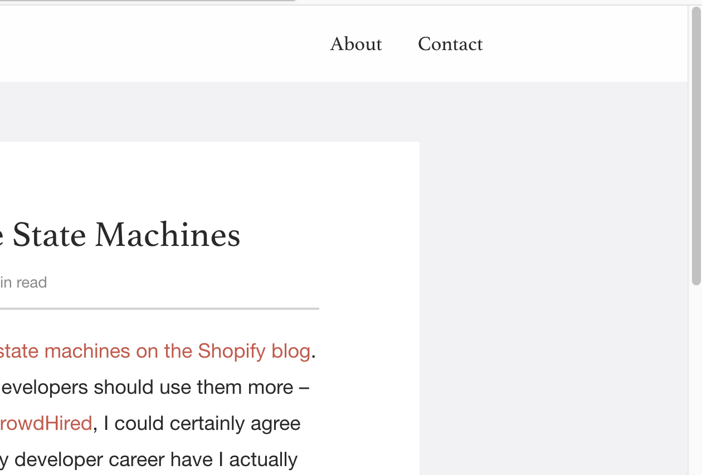
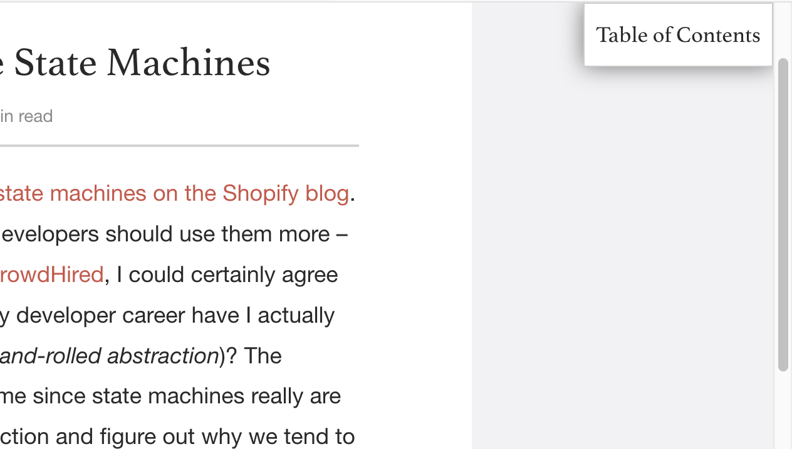
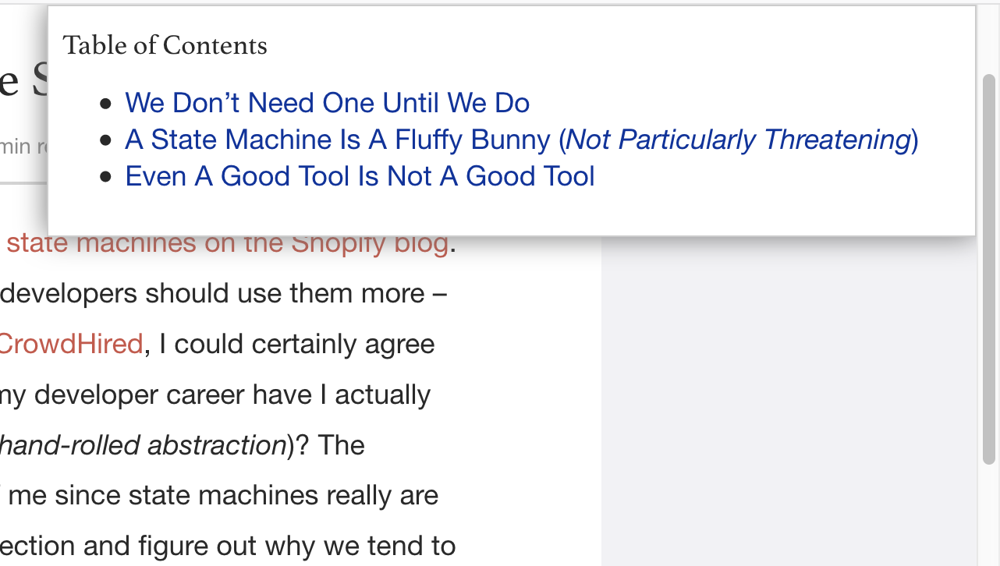
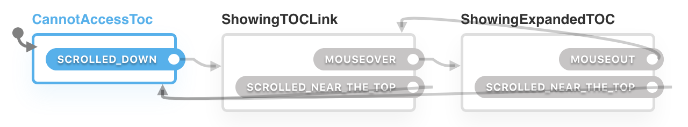
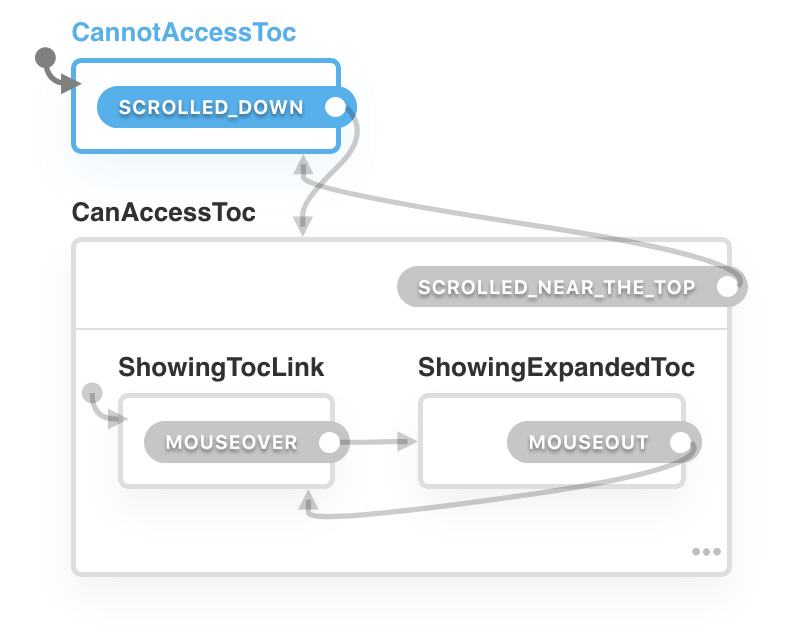

# Source

<https://skorks.com/2011/09/why-developers-never-use-state-machines/>

# Behaviour

-   When the page is scrolled to the top, we see no table of contents (TOC).



-   When the page is scrolled, we see a link to the TOC.



-   When the hover that link, it expands and actually shows the TOC.



# Machine

## Simple version



```js
const machine = Machine({
  initial: 'CannotAccessToc',
  states: {
    CannotAccessToc: {
      on: {
        SCROLLED_DOWN: 'ShowingTOCLink',
      }
    },
    ShowingTOCLink: {
      on: {
        MOUSEOVER: 'ShowingExpandedTOC',
        SCROLLED_NEAR_THE_TOP: 'CannotAccessToc'
      }
    },
    ShowingExpandedTOC: {
      on: {
        MOUSEOUT: 'ShowingTOCLink',
        SCROLLED_NEAR_THE_TOP: 'CannotAccessToc'
      }
    }
  }
});
```

## Statechart



```js
const machine = Machine({
  initial: 'CannotAccessToc',
  on: {
    SCROLLED_NEAR_THE_TOP: 'CannotAccessToc'
  },
  states: {
    CannotAccessToc: {
      on: {
        SCROLLED_DOWN: 'CanAccessToc',
      }
    },
    CanAccessToc: {
      initial: 'ShowingTocLink',
      states: {
        ShowingTocLink: {
          on: {
            MOUSEOVER: 'ShowingExpandedToc',
          }
        },
        ShowingExpandedToc: {
          on: {
            MOUSEOUT: 'ShowingTocLink',
          }
        }
      }
    },
  }
});
```
